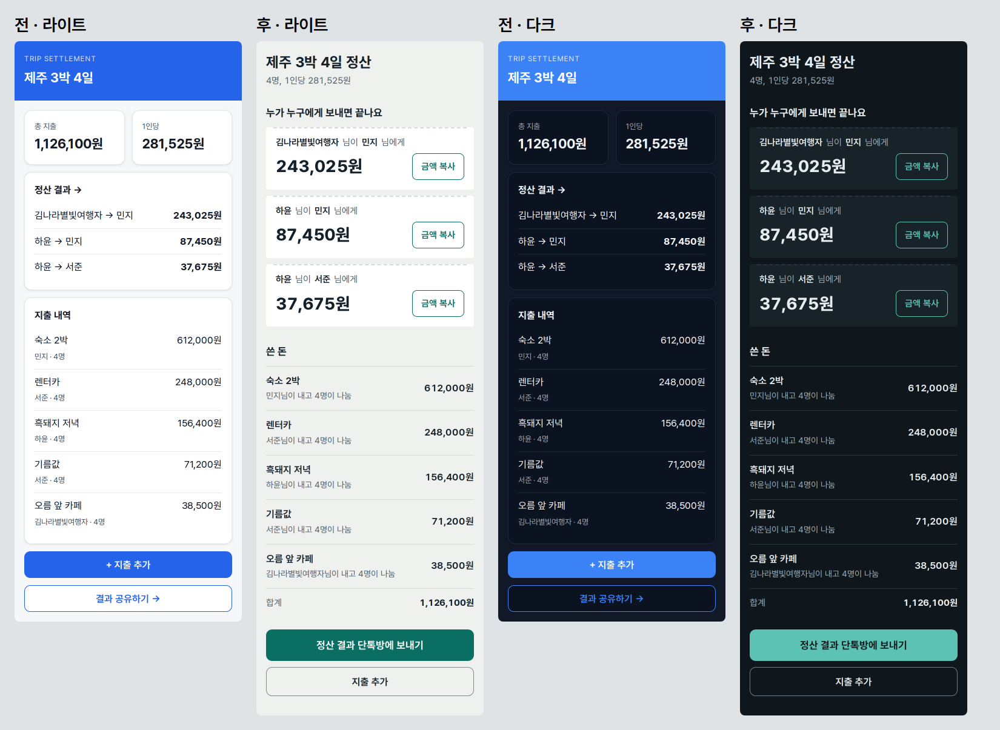

# 디자인 흐름 전후 비교 — "친구 여행 경비 정산 웹"

같은 데이터(4명, 지출 5건, 긴 이름 포함)로 D4 핵심 화면을 두 번 만들었다. 375px, 라이트·다크. 캡처는 Playwright 스크립트.

| | 전 (이전 흐름) | 후 (디자인 도구 계획 적용) |
|---|---|---|
| 방향 | 없음 — `design-tokens.md` 기본값(파랑·기본 카드) 그대로 | D0 방향 한 장 (`after/direction.md`) |
| 도구 계획 | — | 도구형·절약 모드 (`plan-travel-split.md`). 이 환경엔 외부 스킬이 없어 대체 수단(`design-direction.md`) 사용 |
| 첫 화면 주인공 | 총 지출·1인당 숫자 카드 | "누가 누구에게 얼마" 송금 영수증 + 금액 복사 |
| 흔한 AI 티 | 영문 대문자 라벨, 똑같은 그림자 카드, 버튼·제목의 "→" | 없음 (자체 검토 1회에서 "A · B" 메타 줄도 문장으로 바꿈) |
| 자동 접근성 검사 (axe) | 라이트 1건·다크 2건 대비 위반 | 0건 |

- 파일: `before/index.html`, `after/index.html`, `data.js`. 글꼴은 Pretendard(OFL) — 저장소에 넣지 않았으니 열면 시스템 글꼴로 보일 수 있다.
- 외부 스킬(frontend-design·impeccable)이 설치된 환경에서는 D0 가 `frontend-design` 원칙, D6 가 `/impeccable audit`, build 게이트 전 `/impeccable harden` 으로 바뀐다(표 2판).
