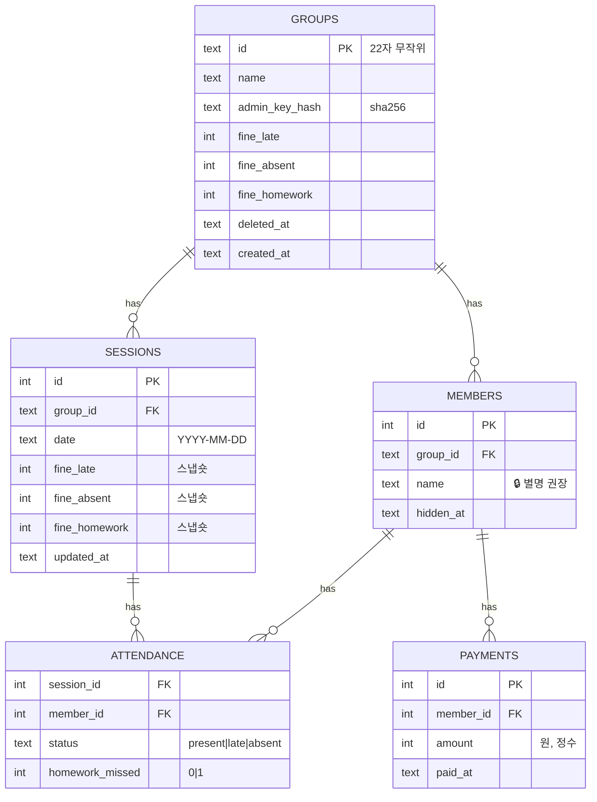

# 아키텍처 — 벌금장부

## S4. 구성
```mermaid
flowchart LR
  B[모바일 브라우저] -->|정적 파일| A[Workers 정적 자산]
  B -->|HTML/JSON| S[Workers (Hono)]
  S --> R[(저장소 어댑터)]
  R --> DB[(D1)]
  S --> L[Workers 로그]
  C[Cron Trigger] --> S
  U[업타임 감시] --> H[/health]
```
- 외부 API 없음. 구성 요소 = 서버 1개 + SQLite 파일 1개.
- 요청 흐름(편집): 브라우저 → `POST /api/groups/:id/...` + 헤더 `X-Admin-Key` → 키 해시 비교(상수 시간) → 입력 검증 → 저장소 → JSON 응답.

## S3. 데이터 모델

- 금액은 원 단위 정수. 시간은 UTC ISO 문자열.
- 인덱스: members(group_id), sessions(group_id, date), attendance(session_id), payments(member_id).
- 🔒 개인정보: 멤버 이름. (IP 는 속도 제한용 메모리에만, 로그에는 해시)

## 외부 연동
| 서비스 | 용도 | 비용 | 폴백 | 키 |
|---|---|---|---|---|
| (없음) | | | | |
| Cloudflare Workers + D1 | 서버·DB·정적 파일·크론 | 무료 등급 (`docs/costs.md`) | — | GitHub Secrets (배포 토큰) |

## ADR
### ADR-004: Cloudflare Workers + D1 로 이전 (무료 운영)
- 상황: 운영비 0원 목표. 처음 구성(Node 서버 + SQLite 파일 + Fly.io)은 월 수천 원 + 카드 등록 필요
- 결정: Workers + D1 + 정적 자산 + Cron Triggers. 저장소 어댑터를 D1 API(비동기, batch=트랜잭션)로 교체
- 결과: 서버 관리·백업(Time Travel)·HTTPS 가 플랫폼 몫. 인스턴스가 여러 개라 메모리 속도 제한은 최선 노력 → 중요한 한도는 D1 테이블로. 테스트는 node:sqlite 기반 D1 흉내(`src/d1-node.js`) + E2E 는 로컬 workerd
- ADR-001(SQLite 파일)·ADR-003 의 서버 1대 전제는 이 결정으로 대체

### ADR-001: SQLite(node:sqlite) + 저장소 어댑터 — ADR-004 로 대체
- 상황: 1인 운영, 데이터 작음, 외부 DB 계정 없이 시작
- 결정: Node 22 내장 `node:sqlite`, 모든 DB 접근은 `src/repo.js` 경유
- 대안: Postgres(Supabase) — 운영 부담·계정 필요 / better-sqlite3 — 네이티브 빌드
- 결과: 서버 1대에 묶임(수평 확장 불가). 사용자 늘면 어댑터만 Postgres 로 교체. `node:sqlite` 는 실험 단계 경고가 있어 Node 버전 고정

### ADR-002: 계정 대신 관리 키 링크
- 결정: 128비트 무작위 키, 해시 저장, 헤더로 전달
- 결과: 키 분실 시 복구 불가(MVP). 링크 유출 시 누구나 편집 → "관리 링크 새로 발급" 기능을 Should 로 추가

### ADR-003: 서버 렌더링 HTML + 소량 바닐라 JS
- 결정: 빌드 도구 없음. 페이지는 서버가 HTML 로, 편집은 fetch
- 결과: 의존성·빌드 최소. 화면이 복잡해지면 프레임워크 도입 재검토
