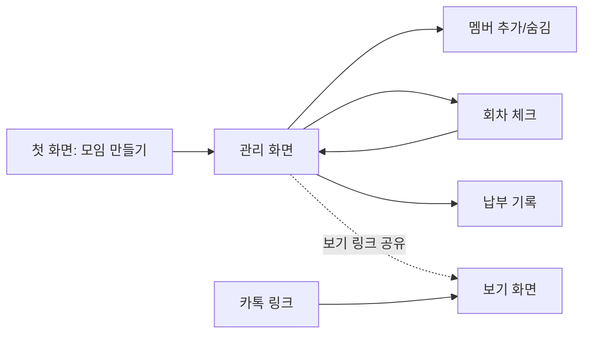

# 디자인 — 벌금장부

> Atelier `design` 스킬로 작성.

## D1. 여정·화면 흐름
운영자: 첫 화면 → 모임 만들기(이름·규칙) → **관리 화면(링크 저장 안내)** → 멤버 추가 → 회차 체크·저장 → 정산 요약 → 보기 링크 공유
- 첫 실행 → 첫 가치(첫 회차 벌금 자동 계산)까지: **4단계** (만들기 → 멤버 추가 → 회차 체크 → 저장). 가입 없음.

멤버: 카톡 링크 → 보기 화면(정산·회차 기록). 1단계.

## D2. 화면·상태
| 화면 | 빈 상태 | 로딩 | 오류 | 권한 없음 | 한도 | 기타 |
|---|---|---|---|---|---|---|
| 첫 화면 | — | 버튼 "만드는 중…" | 필드별 오류 문구, 입력 유지 | — | 시간당 생성 한도 → "잠시 후 다시" | — |
| 관리 화면 | 멤버 0명: "아직 멤버가 없어요" + 추가 | 서버 렌더링(없음) | 저장 실패 토스트 + 재시도 | 틀린 키: 보기 화면으로 안내 | 30명 한도 문구 | 관리 링크 저장 경고 |
| 회차 체크 | 멤버 0명 → 멤버 추가로 유도 | 저장 중 버튼 비활성 | "저장하지 못했어요…" + 입력 유지 | 403 → 안내 | 회차 500개 | 동시 수정 충돌 안내 |
| 보기 화면 | 회차 0: "아직 기록이 없어요" | — | — | 편집 버튼 없음 | — | 삭제된 모임 → 404 |
| 404 | "모임을 찾을 수 없어요" + 새로 만들기 | | | | | |

## D3. 토큰·컴포넌트
- 토큰: `design/tokens.css` (라이트·다크, 모션 줄이기)
- 컴포넌트: `design/app.css` — 버튼(주/보조/위험/비활성), 입력(기본/오류/포커스), 카드, 경고 안내, 표, 출결 세그먼트(라디오), 체크박스, 토스트, 빈 상태
- 입력 테두리는 장식용 `--color-border`(1.36:1) 대신 `--color-border-strong`(3:1 이상) — 접근성 점검에서 발견해 수정

## D4. 시안
`design/mockups/index.html` — 첫 화면(오류 상태), 관리 화면(긴 이름·큰 금액), 회차 체크(저장 실패), 빈 상태. 라이트·다크 스크린숏 확인.

## D5. 프로토타입 테스트
**미실시 (사람 필요)** — 스터디 운영자 3명에게 "모임을 만들고 오늘 회차를 기록한 뒤 멤버에게 공유해 보세요" 과제. launch L1 사용성 테스트와 합쳐 출시 전 진행.

## D6. 접근성 점검
| 기준 | 결과 |
|---|---|
| 텍스트 대비 4.5:1 | 라이트·다크 모든 텍스트 토큰 통과 (최저 5.02) |
| 비텍스트 대비 3:1 | 입력 테두리 라이트 4.05 / 다크 5.14 (surface 위 3.75 / 4.59), 포커스 6.70 / 7.59 통과 |
| 터치 영역 44px | 버튼·입력·세그먼트 `--tap: 44px` |
| 색만으로 정보 전달 금지 | 미납은 빨간색 + "미납" 열 제목, 오류는 문구 동반 |
| 레이블 | 모든 입력에 보이는 레이블, 출결은 `radiogroup` + `aria-label` |
| 포커스 표시 | `:focus-visible` 3px 윤곽선 |
| 모션 | `prefers-reduced-motion` 존중 |
| 스크린리더 수동 확인 | **미실시** — build 후 VoiceOver 로 1회 (사람) |

## D7. 브랜드 에셋
`design/assets/`: `favicon.svg`, `apple-touch-icon.png`(180), `og.png`(1200×630)
