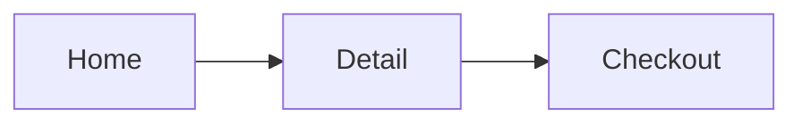

# Design — 디자인

목표: MVP 기능을 **사용자가 헤매지 않는 화면**으로 만들고, 구현이 바로 가져다 쓸 수 있는 **토큰과 시안**을 남긴다.

## 입력
- `docs/idea.md` 의 MVP Must 기능, 대상 사용자
- 사용자가 좋아하는 레퍼런스 서비스 2~3개 (없으면 물어본다)

## 절차

### 1. 핵심 사용자 여정
- Must 기능마다 "사용자가 목표를 이루기까지의 단계"를 적는다.
- **첫 실행 → 첫 가치 경험(aha moment)** 까지의 단계 수를 센다. 줄일 수 있으면 줄인다.
  회원가입은 가능하면 가치 경험 **뒤로** 미룬다.

### 2. 화면 흐름
- 화면 목록과 이동 관계를 Mermaid 로 그린다.

- 화면마다 빈 상태·로딩·오류 상태를 적는다. 이걸 빠뜨리는 경우가 가장 많다.

### 3. 디자인 토큰
`references/design-tokens.md` 구조로 정의한다.
- 색: 의미 기반 이름(`--color-bg`, `--color-text`, `--color-primary`, `--color-danger`). 라이트·다크 둘 다.
- 타이포: 스케일 5~6단계. 간격: 4 또는 8 배수.
- 대비는 `references/accessibility-checklist.md` 기준으로 **계산해서 확인**한다(추정 금지).

### 4. 시안
- 핵심 화면 2~3개를 토큰만 사용하는 단일 HTML 로 만든다. 모바일 폭(375px) 기준, 데스크톱도 확인한다.
- 사용자가 볼 수 있게 보여 주고 피드백을 받아 반복한다.
- 게임이면: HUD, 메인 메뉴, 일시정지·설정 화면을 우선한다.

### 5. 접근성 점검
`references/accessibility-checklist.md` 를 하나씩 확인하고 결과를 표로 남긴다.

## 산출물
- `docs/design.md`: 여정, 화면 흐름, 상태별 화면 목록, 컴포넌트 목록, 접근성 점검표
- `design/tokens.css` (또는 스택에 맞는 토큰 파일)
- `design/mockups/*.html`

## 완료 조건
- [ ] Must 기능 전부 화면 흐름에 포함
- [ ] 화면별 빈·로딩·오류 상태 정의
- [ ] 라이트·다크 토큰 정의, 대비 기준 통과
- [ ] 핵심 화면 시안을 사용자가 확인함
- [ ] 접근성 체크리스트 통과

## 원칙
- 한 화면에 핵심 행동(Primary 버튼)은 하나.
- 장식보다 **위계**(크기·굵기·여백)로 중요도를 보여 준다.
- 브랜드·로고를 흉내 내지 않는다. 폰트·아이콘·이미지는 라이선스를 확인한다(guard 단계에서 재확인).
