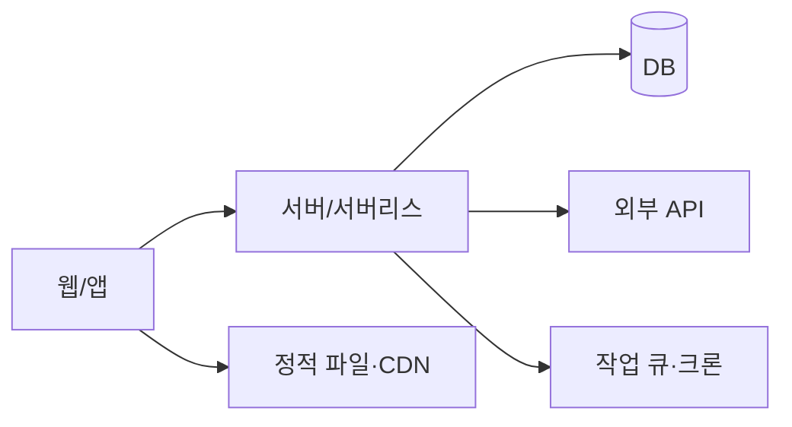

# 아키텍처·비기능 요구

## 1. 구성도

1인 개발 원칙: **구성 요소 수를 최소로.** 관리형 서비스(BaaS·서버리스)로 운영 부담을 줄인다.
마이크로서비스·쿠버네티스는 MVP 에서 쓰지 않는다.

## 2. 요청 흐름
핵심 기능 1~2개를 단계별로 적는다: 클라이언트 → 인증 확인 → 권한 확인 → 처리 → 외부 호출 → 저장 → 응답.

## 3. 외부 연동 표
| 서비스 | 용도 | 무료 한도 / 단가 | 장애 시 폴백 | 키 위치 | 호출 위치 |
|---|---|---|---|---|---|
| 예) 지도 API | 장소 검색 | 일 N 회 | 캐시 결과 + 안내 | 서버 환경변수 | 서버 어댑터 |
규칙:
- 외부 API 는 **어댑터 한 곳**을 거쳐 호출한다 (교체·모킹·한도 관리).
- 비싼 호출은 서버에서만, 결과 캐시, 사용자별 한도.
- 키가 없어도 앱이 죽지 않게 폴백.

## 4. 비기능 요구
| 항목 | 목표 (예) |
|---|---|
| 응답 시간 | 주요 화면·API p95 1초 이내 |
| 가용성 | 월 99.5% (월 약 3.6시간 중단 허용) |
| 동시 사용자 | 출시 초기 N 명 |
| 데이터 보존 | 백업 일 1회, 7~30일 보관 |
| 복구 목표 | 데이터 손실 최대 24시간, 복구 4시간 이내 |
| 월 비용 상한 | N 원 (넘으면 알림) |
| 지원 환경 | 최신 브라우저 2개 버전, iOS/Android 최소 버전 |
| 보안 수준 | 개인정보 등급, 결제 정보 저장 안 함 |

## 5. ADR (결정 기록)
```markdown
### ADR-001: DB 로 Supabase(Postgres) 사용
- 상황: 인증·DB·스토리지가 필요, 1인 운영
- 결정: Supabase
- 대안: Firebase (NoSQL, 복잡한 조회 불리), 직접 Postgres (운영 부담)
- 결과: RLS 로 권한 관리, 무료 한도 초과 시 유료 전환 필요
```
