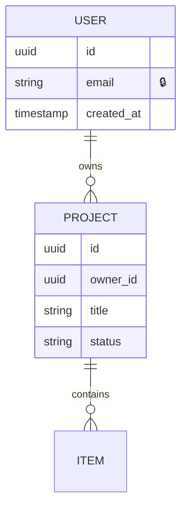

# 데이터 모델

## 순서
1. 명사 찾기: 스토리에서 명사 = 엔터티 후보 (사용자, 코스, 장소, 댓글…)
2. 관계: 1:1 / 1:N / N:M. N:M 은 연결 테이블
3. 필드: 이름, 타입, 필수 여부, 기본값, 제약(고유·범위)
4. 인덱스: 자주 조회·정렬·조인하는 필드
5. 개인정보 표시: 🔒 표시, 암호화·마스킹 필요 여부

## 공통 필드
- `id` (UUID 또는 자동 증가), `created_at`, `updated_at`
- 소프트 삭제가 필요하면 `deleted_at`
- 소유권: `owner_id` → 권한 검사·행 단위 보안(RLS)의 기준

## ERD 예

## 점검
- [ ] 모든 조회 경로에 인덱스가 있는가
- [ ] 삭제 시 연쇄(cascade) 동작이 정책(S2)과 맞는가
- [ ] 돈·재화·수량은 정수(최소 단위) 또는 decimal. float 금지
- [ ] 시간은 UTC 저장, 표시할 때 지역 시간
- [ ] 스키마 변경은 마이그레이션 파일로만 (build B2)
- [ ] 개인정보 필드 목록 = guard 의 수집 항목 표
