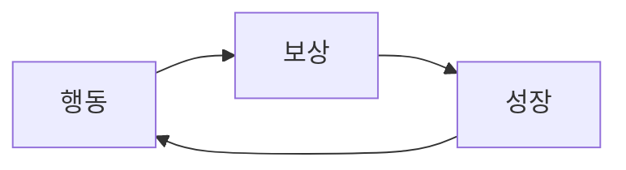

# 게임 설계 (요약 GDD)

## 1. 한 줄 콘셉트
"[장르] 에서 [핵심 동사] 하는 게임. [차별점]."

## 2. 코어 루프
30초~2분 안에 반복되는 행동. 예: 탐험 → 전투 → 보상 → 강화 → 탐험

- 이 루프가 **회색 상자(그래픽 없이)** 상태에서도 재미있는지 먼저 프로토타입으로 확인한다.

## 3. 메타 루프
하루·주 단위 목표: 진행도, 해금, 수집, 순위.

## 4. 경제
- 재화 종류, 획득처(faucet), 소모처(sink) 표
- 획득 > 소모가 계속되면 인플레이션. 시뮬레이션(스프레드시트)으로 확인
- 유료 재화·확률형 아이템이 있으면 확률표 (guard: 확률 공개 의무)

## 5. 난이도 곡선·콘텐츠 분량
- 첫 5분 튜토리얼 흐름
- 레벨·스테이지 수, 1회 플레이 시간, 전체 플레이 시간 목표
- 1인 개발 현실: 콘텐츠는 **절차 생성·재플레이성**으로 분량을 늘리는 설계가 유리

## 6. 조작·플랫폼
- 입력 방식(터치·키보드·패드), 목표 해상도·프레임

## 7. 범위 자르기
- 버티컬 슬라이스: 완성도 높은 1개 스테이지를 먼저 끝까지
